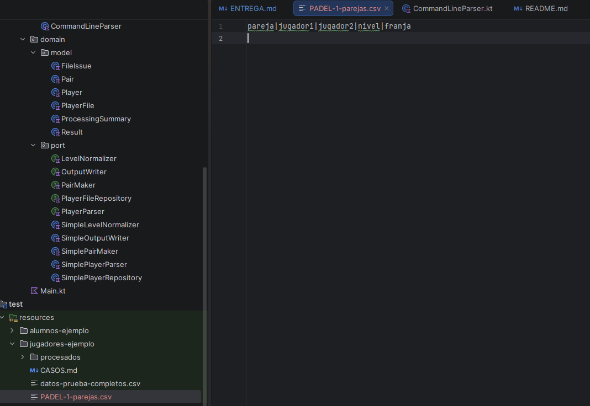
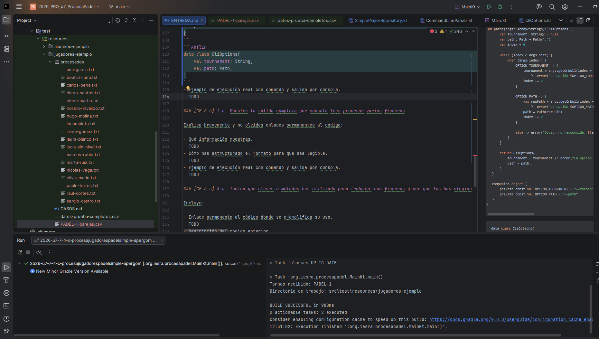

# ENTREGA

Antonio Manuel Pérez Gómez

> Sustituye cada `TODO` por tu respuesta.
> Usa enlaces permanentes de GitHub cuando se pidan enlaces al código.

## Descripción breve de la solución

He realizado una solución incompleta de la aplicación, he retirado la generacion de partidos y he realizado solo hasta la escritura en CSV de las parejas y la realizacion de estas. La solución es simple y utiliza la estructura ya otorgada por el profesor e implementa un repositorio para el almacenamiento de los archivos de los jugadores, un parseador que lee estos mismos archivos y los "descuartiza" en varias lineas para facilitar la lectura de todos los jugadores y sus nombres, un normalizador de los niveles para facilitar la lectura de nivel de cada jugador para luego emparejarlos con otra clase , y por ultimo una clase encargada de escribir en un archivo aparte los datos de las parejas realizadas.

## Ejemplo de ejecución

./gradlew run --args"--torneo <NombreDelTorneo> -- path ./test/resources/jugadores-ejemplo"

### Fichero de parejas

El fichero de parejas se muestra incompleto
```text
pareja|jugador1|jugador2|nivel|franja
```

### Fichero de partidos
No he realizado el apartado de partidos.
```text

```

### Salida por consola con incidencias
Debido a que tampoco he realizado el sumario final no hay salida con incidencias, aun así el programa funciona "correctamente" con el único incidente de que no se rellena correctamente el archivo ".csv". 
```text
Executing ':org.iesra.procesapadel.MainKt.main()'…

> Task :checkKotlinGradlePluginConfigurationErrors SKIPPED
> Task :compileKotlin UP-TO-DATE
> Task :compileJava NO-SOURCE
> Task :processResources NO-SOURCE
> Task :classes UP-TO-DATE

> Task :org.iesra.procesapadel.MainKt.main()
Torneo recibido: PADEL-1
Directorio de trabajo: src\test\resources\jugadores-ejemplo

BUILD SUCCESSFUL in 689ms
2 actionable tasks: 1 executed, 1 up-to-date
```

### Carpeta `procesados` con los ficheros movidos



## Preguntas: COMPLEMENTA LAS RESPUESTAS CON ENLACES PERMANENTES DE GITHUB

### [CE 5.a] 1.a. Muestra cómo tu programa recibe y utiliza los argumentos `--torneo` y `--path`.

Incluye:

- Enlace permanente al código donde se procesan los argumentos.
  TODO
- Breve explicación.
  El programa se ejecuta mediante la lectura de los argumentos en el CommandLineParser.kt, esta clase lo que recibe es un nombre de un torneo y el directorio donde se encuentran los archivos .txt y devuelve un CliOptions con los datos recibidos para posibilitar la ejecucuón de este en Main.kt
  ```kotlin
  fun main(args: Array<String>) {
    val parser = CommandLineParser()
    val options = parser.parse(args)

    val application = PadelProcessingApplication()
    application.run(options)}

  ```
  
 ```kotlin
fun parse(args: Array<String>): CliOptions {
        var tournament: String? = null
        var path: Path = Path(".")
        var index = 0

        while (index < args.size) {
            when (args[index]) {
                OPTION_TOURNAMENT -> {
                    tournament = args.getOrNull(index + 1)?.takeIf(String::isNotBlank)
                        ?: error("La opción $OPTION_TOURNAMENT necesita un valor. Uso: --torneo <NOMBRE> [--path <RUTA>]")
                    index += 2
                }

                OPTION_PATH -> {
                    val rawPath = args.getOrNull(index + 1)?.takeIf(String::isNotBlank)
                        ?: error("La opción $OPTION_PATH necesita un valor. Uso: --torneo <NOMBRE> [--path <RUTA>]")
                    path = Path(rawPath)
                    index += 2
                }

                else -> error("Opción no reconocida: ${args[index]}. Uso: --torneo <NOMBRE> [--path <RUTA>]")
            }
        }

        return CliOptions(
            tournament = tournament ?: error("La opción --torneo es obligatoria."),
            path = path,
        )
    }

    companion object {
        private const val OPTION_TOURNAMENT = "--torneo"
        private const val OPTION_PATH = "--path"
    }
}
```
```kotlin
data class CliOptions(
    val tournament: String,
    val path: Path,
)
```
- Ejemplo de ejecución real con comando y salida por consola.


### [CE 5.b] 2.a. Muestra la salida completa por consola tras procesar varios ficheros.

Explica brevemente y no olvides enlaces permanentes al código:

- Qué información muestras.
  TODO
- Cómo has estructurado el formato para que sea legible.
  TODO
- Ejemplo de ejecución real con comando y salida por consola.
  TODO

### [CE 5.c] 3.a. Indica qué clases o métodos has utilizado para trabajar con ficheros y por qué los has elegido.

Incluye:

- Enlace permanente al código donde se ejemplifica su uso.
  TODO
- Descripción del código anterior.
  Se han utilizado las siguientes clases:
    Repositorio: Almacenamiento de archivos de jugadores.
    Parseador: Lector de archivos por lineas para poder mandar la información a la aplicación.
    Normalizador de nivel: Simplemente hace que los niveles sean tal y como se piden en el README.
    Emparejador: Junta a los jugadores segun su nivel y horario.
    Escritor de salida: En este caso, escribe las parejas en unn archivo .csv separadas por "|". 

    Dentro de estas clases he decidido utilizar las clases File y Path las cuales son esenciales para la realización de esta practica, puesto que es la manera de acceder y editar archivos desde un programa en java/kotlin.
    Otros metodos usados son por ejemplo listAllFiles(), listDirectoriesEntries(), writeText() que son metodos especificos de estas librerias (java.nio.file.* y kotlin.io.path.*)
- Justificación de por qué usas esas clases o métodos y no otros.
  He escogido estas librerias/clases/metodos debido a que son las mas acordes a como plantee el programa y son las que as he trabajado al preparar esta práctica. Con esto quiero decir que existen miles de metodos y que aunque haya algunos que sean mucho mejores y que se podría haber aplicado a esto mismo, yo he escogido estos debido a mi experiencia con este tema.

### [CE 5.d] 4.a. Muestra cómo interpretas el formato del fichero de entrada y cómo validas que sea correcto.

Incluye:

- Enlace permanente al código de lectura y validación.
  TODO
- Descripción del código anterior.
  El fichero se interpreta desde el repositorio y realiaz una busqueda en el path 
- Un ejemplo de error detectado por tu programa y cómo se gestiona.
  TODO

### [CE 5.e] 5.a. Breve comentario sobre tu código, con enlaces permanentes, acerca de cómo realizas:

- Describe la lectura de ficheros.
  TODO
- Describe la escritura de resultados CSV y TXT.
  TODO
- Describe el movimiento de ficheros a la carpeta `procesados`.
  TODO

Incluye un enlace permanente a cada caso y una breve explicación.

## Checklist final

- [ ] He rellenado todos los `TODO`.
- [ ] He añadido enlaces permanentes de GitHub.
- [ ] He incluido ejemplos reales de ejecución y salida.
- [ ] He revisado el formato final.
