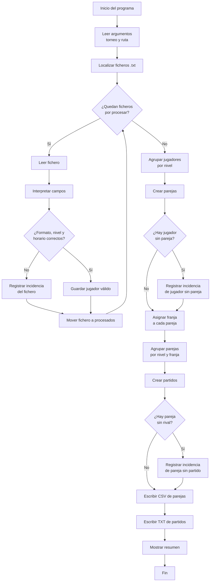

[](https://classroom.github.com/a/zG5nezf3)
# Actividad unidad 7: Entrada y salida. Procesamiento de inscripciones de pádel

> Toda la documentación de entrega se realizará en [ENTREGA.md](./ENTREGA.md).

## Descripción del ejercicio

Aplicación de consola para procesar ficheros de personas inscritas en una jornada de pádel, crear parejas del mismo nivel y generar una propuesta de partidos.

Cada jugador o jugadora entrega un fichero de texto cuyo nombre coincide con su identificador de inscripción, por ejemplo `ana-garcia.txt`. Ese fichero incluye:

- Nombre.
- Apellidos.
- Nivel declarado.
- Franja horaria preferida.

Ejemplo de fichero de entrada:

```text
Nombre: Ana
Apellidos: García López
Nivel: intermedio
Horario = tarde
```

El programa debe leer todos los ficheros `.txt` del directorio indicado y realizar este procesamiento:

1. Validar que cada fichero contiene los cuatro datos requeridos.
2. Validar que el nivel declarado coincide exactamente con uno de estos valores: `iniciación`, `intermedio` o `avanzado`.
3. Validar que la franja horaria coincide exactamente con uno de estos valores: `mañana`, `tarde` o `indiferente`.
4. Crear parejas de dos jugadores del mismo nivel.
5. Asignar una franja horaria a cada pareja aplicando las reglas indicadas más abajo.
6. Registrar como incidencia a cualquier jugador válido que quede sin pareja.
7. Generar partidos entre dos parejas del mismo nivel y de la misma franja horaria.
8. Registrar como incidencia cualquier pareja que quede sin partido.
9. Generar un fichero `<torneo>-parejas.csv` con las parejas creadas.
10. Generar un fichero `<torneo>-partidos.txt` con los partidos propuestos.
11. Mover cada fichero leído a una carpeta llamada `procesados`.
12. Mostrar por salida estándar un resumen del procesamiento.

## Diagrama de flujo



## Descripción del comando

El programa se llamará `procesa-padel` y se ejecutará desde línea de comandos con estas opciones:

- `--torneo <NOMBRE>`: obligatorio. Indica el identificador de la jornada o torneo, por ejemplo `PADEL-1`.
- `--path <RUTA>`: opcional. Indica la carpeta donde están los ficheros de entrada. Si no se informa, se usa el directorio de trabajo actual.

Sintaxis propuesta:

```bash
procesa-padel --torneo <NOMBRE> [--path <RUTA>]
```

## Ejemplos de uso del comando

Procesar los ficheros del directorio actual:

```bash
procesa-padel --torneo PADEL-1
```

Procesar los ficheros de una carpeta concreta:

```bash
procesa-padel --torneo PADEL-1 --path ./datos/jugadores
```

## Ejemplos de ficheros de entrada

### Ejemplo 1: jugadora de nivel intermedio

Archivo: `ana-garcia.txt`

```text
Nombre: Ana
Apellidos: García López
Nivel: intermedio
Horario = tarde
```

### Ejemplo 2: jugador avanzado con horario indiferente

Archivo: `marcos-rubio.txt`

```text
Nombre: Marcos
Apellidos: Rubio Pérez
Nivel: avanzado
Horario = indiferente
```

### Ejemplo 3: jugadora con nivel no válido

Archivo: `lucia-sin-nivel.txt`

```text
Nombre: Lucía
Apellidos: Navarro Soto
Nivel: experto
Horario = mañana
```

## Reglas de procesamiento

- Los niveles válidos de entrada son exactamente `iniciación`, `intermedio` y `avanzado`.
- Las franjas válidas de entrada son exactamente `mañana`, `tarde` e `indiferente`.
- Si el nivel no coincide exactamente con uno de los valores válidos, el fichero se registra como incidencia.
- Si la franja horaria no coincide exactamente con uno de los valores válidos, el fichero se registra como incidencia.
- El programa puede mostrar los niveles en mayúsculas en los ficheros de salida: `INICIACIÓN`, `INTERMEDIO` y `AVANZADO`.
- Cada pareja debe tener exactamente dos jugadores del mismo nivel.
- Las parejas se crean tomando los jugadores de dos en dos dentro de cada nivel.
- Si una persona queda sin pareja dentro de su nivel, se registra como incidencia y no participa en partidos.
- Si ambos miembros de una pareja prefieren la misma franja, esa será la franja de la pareja.
- Si una persona prefiere `indiferente` y la otra `mañana` o `tarde`, la pareja usará la franja concreta.
- Si ambas personas prefieren `indiferente`, la pareja se asignará a la franja con menos parejas acumuladas en ese nivel. En caso de empate, se usará `mañana`.
- Si una persona prefiere `mañana` y la otra `tarde`, la pareja se asignará a la franja con menos parejas acumuladas en ese nivel. En caso de empate, se usará `mañana`.
- Cada partido enfrenta a dos parejas del mismo nivel y de la misma franja horaria.
- Dentro de cada grupo de parejas con el mismo nivel y franja, los partidos se crean tomando las parejas de dos en dos.
- Si queda una pareja sin rival dentro de su nivel y franja, debe aparecer en incidencias como pareja pendiente de partido.
- Los ficheros con errores de formato, nivel u horario no generan jugador válido, pero también se mueven a `procesados`.
- Tras procesar cada fichero `.txt`, este debe moverse al directorio `procesados`.
- El directorio `procesados` debe crearse automáticamente si no existe.
- El separador del CSV será `|`.

## Ejemplos de ficheros de salida

### Fichero de parejas

Archivo: `PADEL-1-parejas.csv`

```text
pareja|jugador1|jugador2|nivel|franja
P1|Laura Blanco Díaz|Irene Gómez Solís|INICIACIÓN|mañana
P2|Carlos Peña Mora|Diego Santos Vera|INICIACIÓN|tarde
P3|Sergio Castro Ríos|Ana García López|INTERMEDIO|tarde
P4|Elena Martín Gil|Hugo Molina Vega|INTERMEDIO|tarde
P5|Raúl Cortés Núñez|Beatriz Luna Sánchez|AVANZADO|mañana
P6|Olivia Marín Ortega|Marcos Rubio Pérez|AVANZADO|tarde
P7|Pablo Torres Díaz|Nicolás Vega Romero|AVANZADO|tarde
```

### Fichero de partidos

Archivo: `PADEL-1-partidos.txt`

```text
[Partido-1]
Nivel: INTERMEDIO
Franja: tarde
P3: Sergio Castro Ríos / Ana García López
P4: Elena Martín Gil / Hugo Molina Vega

[Partido-2]
Nivel: AVANZADO
Franja: tarde
P6: Olivia Marín Ortega / Marcos Rubio Pérez
P7: Pablo Torres Díaz / Nicolás Vega Romero
```

## Resumen esperado por salida estándar

Al finalizar, el programa debe mostrar un resumen similar a este:

```text
Ficheros procesados: 18
Ficheros con errores: 3
Jugadores válidos: 15
Parejas creadas: 7
Partidos creados: 2

Resumen de parejas:
- INICIACIÓN mañana: 1 pareja
- INICIACIÓN tarde: 1 pareja
- INTERMEDIO tarde: 2 parejas
- AVANZADO mañana: 1 pareja
- AVANZADO tarde: 2 parejas

Incidencias:
- archivo lucia-sin-nivel.txt: nivel no reconocido, queda sin inscripción válida.
- archivo horario-invalido.txt: horario no reconocido, queda sin inscripción válida.
- archivo incompleto.txt: falta el campo Horario, queda sin inscripción válida.
- jugadora Marta Ruiz Cano: queda sin pareja en el nivel INTERMEDIO.
- pareja P1: queda pendiente porque no hay otra pareja de nivel INICIACIÓN en la franja mañana.
- pareja P2: queda pendiente porque no hay otra pareja de nivel INICIACIÓN en la franja tarde.
- pareja P5: queda pendiente porque no hay otra pareja de nivel AVANZADO en la franja mañana.
```

## Datos de prueba

El directorio `src/test/resources/jugadores-ejemplo` incluye ficheros de ejemplo para comprobar los casos principales:

- Ficheros válidos en los tres niveles.
- Franjas válidas `mañana`, `tarde` e `indiferente`.
- Parejas con misma franja.
- Parejas con una persona `indiferente`.
- Parejas con conflicto entre `mañana` y `tarde`.
- Jugador válido sin pareja por número impar de personas en un nivel.
- Pareja válida sin partido por número impar de parejas en un mismo nivel y franja.
- Fichero con nivel no válido.
- Fichero con horario no válido.
- Fichero incompleto.

La descripción completa de los casos está en `src/test/resources/jugadores-ejemplo/CASOS.md`.

## Preguntas: COMPLEMENTA LAS RESPUESTAS CON ENLACES PERMANENTES DE GITHUB

> [CE 5.a] 1.a. Muestra cómo tu programa recibe y utiliza los argumentos `--torneo` y `--path`.

Incluye:

- Enlace permanente al código donde se procesan los argumentos.
- Breve explicación.
- Ejemplo de ejecución real con comando y salida por consola.

> [CE 5.b] 2.a. Muestra la salida completa por consola tras procesar varios ficheros.

Explica brevemente y no olvides enlaces permanentes al código:

- Qué información muestras.
- Cómo has estructurado el formato para que sea legible.
- Ejemplo de ejecución real con comando y salida por consola.

> [CE 5.c] 3.a. Indica qué clases o métodos has utilizado para trabajar con ficheros y por qué los has elegido.

Incluye:

- Enlace permanente al código donde se ejemplifica su uso.
- Descripción del código anterior.
- Justificación de por qué usas esas clases o métodos y no otros.

> [CE 5.d] 4.a. Muestra cómo interpretas el formato del fichero de entrada y cómo validas que sea correcto.

Incluye:

- Enlace permanente al código de lectura y validación.
- Descripción de cómo validas el formato y qué errores detectas.
- Un ejemplo de error detectado por tu programa y cómo se gestiona.

> [CE 5.e] 5.a. Breve comentario sobre tu código, con enlaces permanentes, acerca de cómo realizas:

- Lectura de ficheros.
- Escritura de resultados CSV y TXT.
- Movimiento de ficheros a la carpeta `procesados`.

Incluye un enlace permanente a cada caso y una breve explicación.

## Entrega

El ejercicio se entregará a través de un repositorio de GitHub. El repositorio debe incluir:

- El código fuente de la aplicación, que debe ser funcional.
- `ENTREGA.md` con las respuestas a las preguntas de evaluación.
- Ejemplos reales de ejecución.
- Ejemplos de los ficheros de salida tras ejecutar el programa.

### Comprobación obligatoria de enlaces e imágenes

Es muy importante comprobar la entrega directamente en GitHub después de hacer `commit` y `push`.

Antes de entregar, revisa que:

- El programa funciona correctamente y genera los ficheros de salida esperados.
- Todos los enlaces permanentes a fragmentos de código muestran las líneas exactas usadas como evidencia.
- Los enlaces permanentes usan una URL asociada a un commit concreto, no a una rama como `main` o `master`.
- Todas las imágenes incluidas en `README.md` o `ENTREGA.md` se ven correctamente desde GitHub.
- No hay enlaces a rutas locales del ordenador, como `C:\...`, `/home/...` o imágenes que solo existen fuera del repositorio.

Puedes consultar la documentación oficial de GitHub sobre cómo crear enlaces permanentes a código en:
[Crear un enlace permanente a un fragmento de código](https://docs.github.com/en/github/managing-your-work-on-github/creating-a-permanent-link-to-a-code-snippet).
